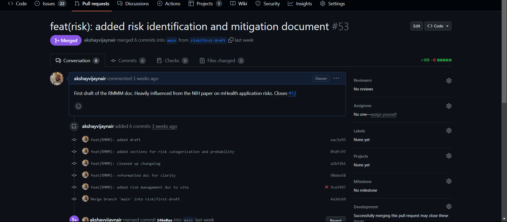
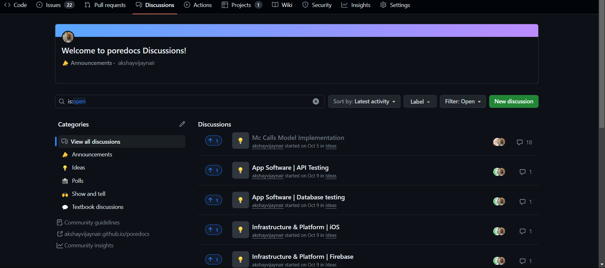
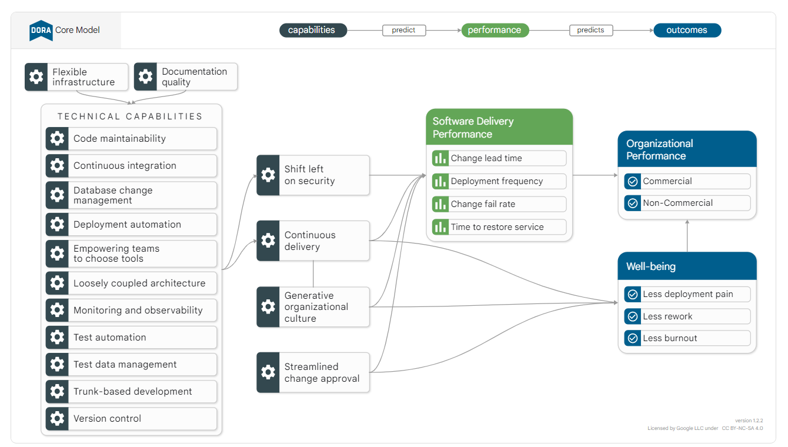

# Software Quality Assurance Plan

# Table of Contents
1. [Introduction](#i-introduction)
2. [Importance of Quality Assurance](#importance-of-quality-assurance)
3. [QA Strategy](#ii-qa-strategy)
4. [Testing Scope](#iii-testing-scope)
5. [Test Environment](#iv-test-environment)
6. [Test Tooling](#v-test-tooling)
7. [Test Cases](#vi-test-cases)
8. [Defect Tracking](#vii-defect-tracking)
9. [Continuous Integration/Continuous Deployment (CI/CD)](#viii-continuous-integrationcontinuous-deployment-cicd)
10. [Team Collaboration](#ix-team-collaboration)
11. [Scaling Efforts](#x-scaling-efforts)
12. [Quality Metrics](#xi-quality-metrics)
13. [Conclusion](#xii-conclusion)
14. [Appendices](#xiii-appendices)

## I. Introduction
### Overview 
The iOS skincare application is designed to revolutionize users' skincare routines by leveraging cutting-edge technology and expert advice. Our application employs image analysis to identify individual skin issues, connects users with skincare professionals for personalized advice, and provides a curated marketplace for purchasing skincare products aligned with their unique needs.
### Objectives
- **Image Analysis:** Utilize advanced algorithms to analyze user-uploaded photos and identify specific skincare issues.
- **Professional Consultation:** Facilitate seamless communication between users and skincare professionals for personalized skincare advice.
- **Marketplace:** Offer a marketplace within the application, recommending products based on the analysis and advice received.

### Target Audience
The primary target audience includes individuals seeking personalized skincare solutions, guidance from professionals, and convenient access to curated skincare products.

### Key Features
1. **Image Analysis:**
    - Analyze user-uploaded photos for various skincare issues.
    - Provide detailed reports on identified concerns.

2. **Professional Consultation:**
    - Connect users with skincare professionals for personalized advice.
    - Enable real-time communication and consultation within the app.

3. **Marketplace:**
    - Curate a marketplace offering skincare products aligned with users' analysis and recommendations.
    - Seamless integration for users to make informed purchases.

## Importance of Quality Assurance
Quality Assurance plays a pivotal role in ensuring the reliability, functionality, and security of the iOS skincare application. By implementing robust QA processes, we aim to deliver a high-quality user experience, building trust and satisfaction among our user base.

## II. QA Strategy
- Define the overall QA strategy for the project.
  - We will use GitHub as a singular source of truth for code artifacts, process management, automation, delivery, and documentation.
  - All documentation, from internal design documents, End user manuals, troubleshooting patterns will be served as github pages site
  - We will use Github actions to automate as many part of the workflow, to enable adherence to established guideline and practises and achieve a high quality.
  - We will also leverage GitHub projects to track and manage all the work as part of the SDLC.

- Specify the testing methodologies to be employed (e.g., manual testing, automated testing).
- Outline the testing levels (unit, integration, system, acceptance).

## III. Testing Scope
### i) Unit Testing for skin Features:
Developers write XCTest unit tests to validate specific functions, such as skin filter algorithms or image processing for skin analysis.

### ii) UI Testing for skin UI Elements:
XCUITest scripts simulate user interactions with skin-specific UI elements, ensuring they respond appropriately and maintain visual integrity.

### iii) Visual Regression Testing for Aesthetics:
Employ visual regression testing tools to capture baseline aesthetics and detect unintended visual changes in skin or interface elements.

### iv) Performance Testing for Image Processing:
Use Xcode Instruments to profile performance, focusing on optimizing image processing speed for skin tracking and analysis.

### v) Accessibility Testing for Inclusivity:
Leverage the Accessibility Inspector to guarantee that skin application features are accessible to all users, including those relying on accessibility features.

### vi) Continuous Integration with skin Focus:
Integrate Fastlane into the CI/CD pipeline, automating tests for skin features to maintain consistency and reliability across different builds.

### vii) Beta Testing for Real-World Evaluation:
Fastlane facilitates beta releases, allowing testers to evaluate skin features like augmented reality makeup or skincare simulations in diverse real-world scenarios.

### viii) End-to-End Testing for User Journeys:
Design end-to-end testing scenarios that span the complete user journey, ensuring application features work seamlessly across different screens and user interactions.

### ix) User Feedback Integration for Iterative Improvement:
Implement analytics tools to collect user feedback on Pore's features, informing iterative improvements for an enhanced user experience.

### x) Final Release Assurance:
Prior to the final release, employ Fastlane to automate the deployment process, conducting a final round of tests to ensure the skin application is ready for public access with high-quality aesthetics and functionality.

## IV. Test Environment
- MacOS systems for local level testing, Mac Virtual Machines for cloud based testing
- Minimum iOS supported version : iOS 16
- Fastlane will be utilized as a mechanism to automate testing and deployment process
  - https://fastlane.tools/
- All tests will be executed at the PR level
- Additional details at the platform and infrastructure testing page: [platform and infra page](/PLATFORM_AND_INFRA_TESTING.md)

## V. Test Tooling
### 1. Xcode:
Xcode serves as the central hub for iOS skin application development and testing. Developers utilize its Interface Builder to craft visually captivating user interfaces for skin features. During testing, Xcode's simulator allows for real-time validation of UI responsiveness and aesthetics across various iOS devices, ensuring a seamless user experience.

### 2. XCTest/XCUITest:
XCTest is harnessed for writing unit tests, scrutinizing the functionality of specific code segments in the skin app. Meanwhile, XCUITest extends testing to the UI, where automated scripts simulate user interactions—critical for assessing the correct implementation of skin-centric features, such as diagnosis and skin health.

### 3. Fastlane:
Fastlane streamlines the testing and deployment processes for skin applications. It automates repetitive tasks, ensuring that the app's aesthetics and features remain intact throughout the testing pipeline. Fastlane's integrations facilitate beta testing, allowing stakeholders to evaluate skin features in a real-world environment before the final release.

Additional details can be found here:[testing and tooling page](/TESTING_AND_TOOLING.md)

## VI. Test Cases
- Front end testing: [front end testing page](/FRONT_END_TESTING.md)
- API testing:[api testing page](/API_TESTING.md)
- DB testing: [database testing page](/DATABASE_TESTING.md)

## VII. Defect Tracking
- Integrate GitHub Issues for defect tracking.
- Define severity and priority levels for different issues.

## VIII. Continuous Integration/Continuous Deployment (CI/CD)
- Detail the CI/CD pipeline setup
  - All relevant tests will be executed at the PR, when code is being opened for review
  
  - PRs should be connected to an item from the open issue items, therby connecting it to the project items
  
  - PRs should trigger github actions that execute test case
  
  - Once the PR is merged, it should trigger another action to build and deploy the code
  

## IX. Team Collaboration
- Establish guidelines for communication within the team
  - All communications related to the project should be documented at the repo discussions page
  
- Define roles and responsibilities related to QA. - [Project Roles](/ROLES.md)
- All project goals should have predefined goals and deadlines marked out

## X. Scaling Efforts
- Provide guidelines for onboarding new team members - 
  - All hiring and team member expectations are defined here: [Project Roles](/ROLES.md)
- Document procedures for scaling QA efforts as the team grows
  - All change management should be start at the github discussions page, which after conclusively proving a need, should be converted into an issue
  

## XI. Quality Metrics
- We are adopting DORA as a metric to understand our code quality :  https://dora.dev/research/
  

## XII. Conclusion
- Quality in a domain that revolves around user health requires a high rate of accuracy. As from the risk modelling, we understand that there is inherent harm from false data, incorrect advice from consultants, legal liabilities from losing private user data.
- Therefore, the practises established above and adherence to the above should allow the team to ensure a high quality app, whilst also greatly reducing risks to users

- While this document does establish the use of the latest and greatest practises in the app development space, it is encouraged to keep looking at new tools and processes that come in that could be adopted in this project.

## XIII. Appendices
- https://docs.github.com/en
- https://docs.fastlane.tools/
